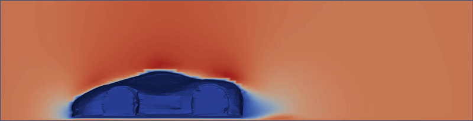
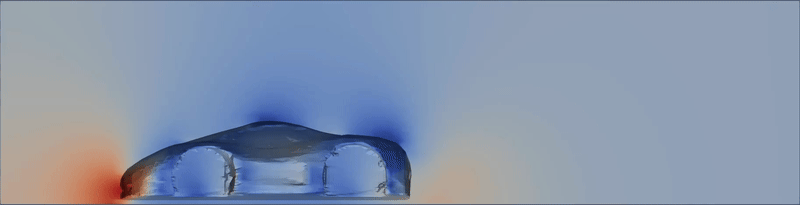
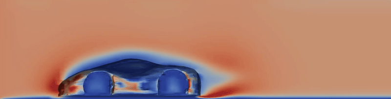
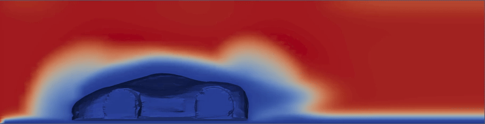

# 🚗 car_des - DES Case

Case-specific notes for the DES setup.  
General workflow (mesh/run/parallel) is documented in the repository root `README.md`.

## Setup Details

- OpenFOAM version: 12
- Preferred run command: `pimpleFoam`
- Turbulence setup: DES (`kOmegaSSTDES`)
- Parameter update script (run inside this folder): `./updateCaseParams.sh`

## Example Results

The GIFs below are example outputs showing how `car_des` behaves.

> [!NOTE]
> These results are based on geometry with `scale=0.001`.
> If needed, convert geometry scale with `surfaceConvert`.

> [!IMPORTANT]
> If you change geometry scale, update `scale` in `updateCaseParams.sh` and run the script again to recalculate case parameters.

Velocity (`U`)

Pressure (`p`)

Turbulence Kinetic Energy (`k`)

Turbulent Viscosity (`nut`)
